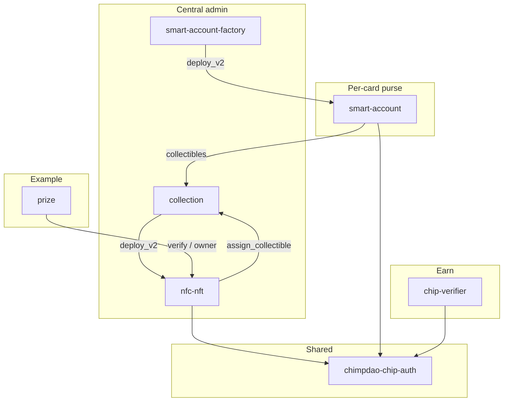
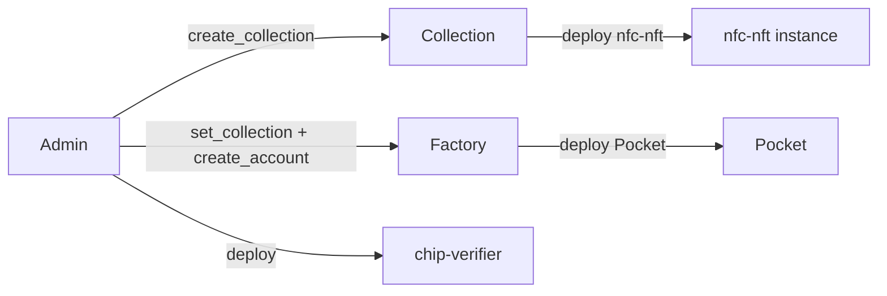
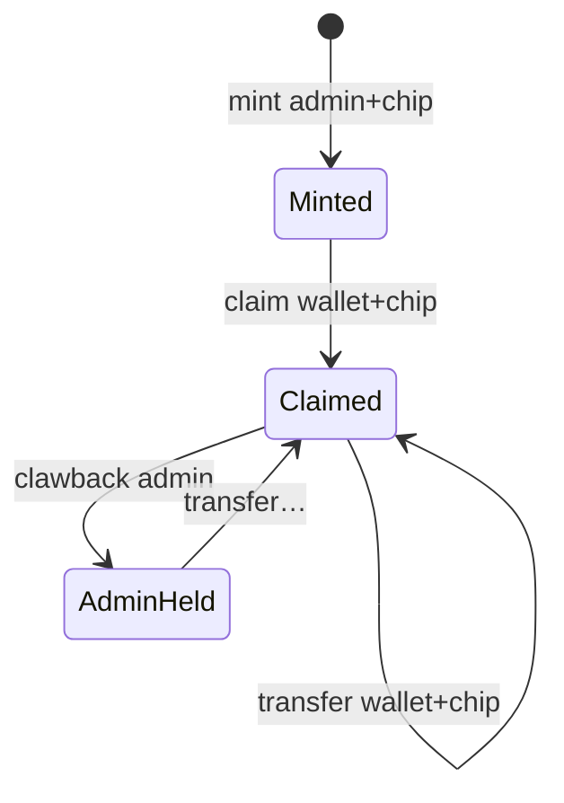

# Architecture

Chi//mp binds Stellar state to a physical NFC chip: the chip’s private key never leaves
silicon. Two product lines share [`chimpdao-chip-auth`](../contracts/chip-auth/).

The account model the contracts follow:

```text
Passkey ──┐                        (recovery / signer management)
          ├──> Nido account (OZ smart_account)  = THE ACCOUNT
Card A ───┤      · the durable balance, Earn positions, identity
Card B ───┘      · signers: External(chip-verifier, pubkey) per card
                 │
                 ├──> Pocket purse (per card, salt = sha256(pubkey))
                 │      small float for fast taps; loss-tolerant
                 │      recoverable by the owning Nido account via `sweep`
                 └──> card NFT (one per physical card, owned by the account)
```

Replacing a card never touches the account address, its balance or its Earn positions —
it is `remove_signer` + `add_signer` on the Nido account. The purse is deliberately keyed
by chip pubkey because it *is* per-card and disposable.

Signing details: [AUTH.md](AUTH.md).

## Crates

| Path | Package | Role |
|------|---------|------|
| [`contracts/chip-auth/`](../contracts/chip-auth/) | `chimpdao-chip-auth` | Shared digest + k1/r1 verify (rlib, not deployed) |
| [`contracts/collection/`](../contracts/collection/) | `collection` | Deploy nfc-nft + cross-collection ownership index |
| [`contracts/nfc-nft/`](../contracts/nfc-nft/) | `nfc-nft` | SEP-50 NFT; chip-gated mint/claim/transfer |
| [`contracts/smart-account-factory/`](../contracts/smart-account-factory/) | `chimpdao-smart-account-factory` | Deploy Pocket (`salt = sha256(pubkey)`) |
| [`contracts/smart-account/`](../contracts/smart-account/) | `chimpdao-smart-account` | Pocket — per-card purse; `CustomAccountInterface` |
| [`contracts/chip-verifier/`](../contracts/chip-verifier/) | `chimpdao-chip-verifier` | OZ `Verifier` for Nido Earn |
| [`examples/prize/`](../examples/prize/) | `prize` | **Example** vault app (not core protocol) |

Off-repo: [chimpdao-nfc-bridge](../README_NFC.md) (USB reader), [chimpdao-terminal](../README.md) (merchant POS).

## Dependency graph



`contractimport!` reads `target/wasm32v1-none/release/`. Nothing is committed — the
previous committed copies let dependents compile against a months-old ABI. The build
therefore has an order; `make contract_build` handles it.

## Deploy



- Collection salt = `sha256(symbol)`.
- Pocket salt = `sha256(chip_pubkey)`.
- Factory constructor is admin-only. Set the collection pointer **and** the approved Pocket wasm hash before deploying accounts. Pocket constructor: `(collection, chip, curve, owner, upgrade_policy)`.

## NFT lifecycle



`mint` writes `PublicKey` / `TokenIdByPublicKey` / `ChipCurveByPublicKey`. Unclaimed tokens have no `Owner`. Claim/transfer/clawback call `collection.assign_collectible` (caller must be a registered collection contract).

## Pocket

Per-chip C-address implementing `CustomAccountInterface`. The chip signs the host's
authorization payload, so every call it authorizes is bound to that call's contract,
function, arguments, network, nonce and expiration ledger.

There is **no** `transfer` entry point: a payment is a plain SAC
`transfer(pocket, merchant, amount)` and the host routes authorization here. The same
purse therefore works with Blend or anything else without new contract code.

`sweep(token, to)` is the exception — gated by the stored `Owner` (the holder's Nido
account) rather than the chip, because it is the lost-card path and has to work when the
card is gone.

Earn DeFi runs on the linked Nido account; Pocket stores
`EarnLink { account, context_rule_id, verifier }` and position hints. See
[AUTH.md](AUTH.md).

## Prize (example)

Deposit locks SEP-41 under chip pubkey (resolved via nfc `public_key(token_id)`). Redeem: wallet auth + a chip attestation under the prize domain + `owner_of == redeemer`. See [`examples/prize/README.md`](../examples/prize/README.md).

## Storage (compact)

**collection** — Instance: `Admin`, `Collections`. Persistent: `Collectibles(collection, token_id) → owner`, `OwnerCollectibles(owner) → Vec<(collection, token_id)>`.

**nfc-nft** — Instance: admin, collection, metadata, `NextTokenId`, `MaxTokens`. Persistent: owner/balance/pubkey maps, `ChipNonceByPublicKey`, `ChipCurveByPublicKey`.

**Pocket** — Instance: `CollectionContract`, `Chip`, `Curve`, `Owner`, `UpgradePolicy`. Persistent: `Earn`, `Position(id)`, `PositionIds`. (No `Nonce` — the host owns replay protection.)

**factory** — Instance: `Admin`, `CollectionContract`, `PocketWasmHash`. Persistent: `Account(pubkey) → Address`.

**prize** — Instance: `Admin`, `Token`, `NfcContract`. Persistent: `Vault(pubkey) → i128`, `Nonce(pubkey) → u32`.

**chip-verifier** — none (stateless).
