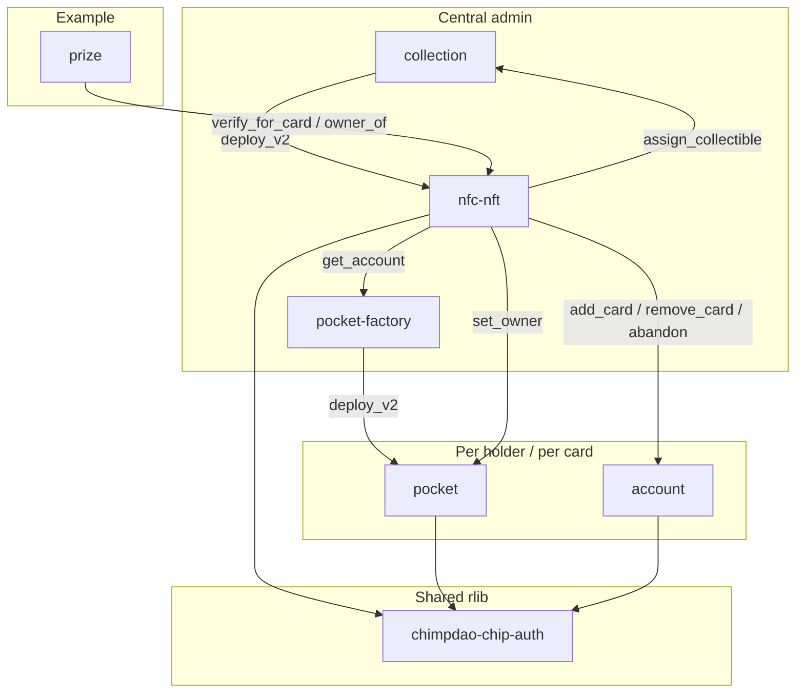
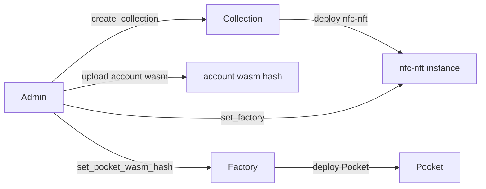
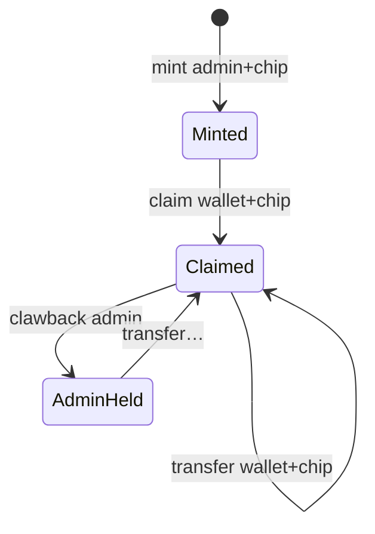

# Architecture

Chimp binds Stellar state to a physical NFC chip: the chip's private key never leaves
silicon. Every contract that has to check a chip signature links the same
[`chimpdao-chip-auth`](../contracts/chip-auth/) rlib.

The account model the contracts follow:

```text
Card A ───┐      Chimp account  = THE ACCOUNT (durable root)
Card B ───┤        · a flat set of cards; any one of them signs (1-of-n)
          │        · identity is the card's 65-byte SEC1 key itself
          │
          ├──> Pocket purse (per card, salt = sha256(pubkey))
          │      the card's float AND its DeFi positions
          │      recoverable by the owning Chimp account via `sweep`
          └──> card NFT (one per physical card, owned by the account)
```

Adding or replacing a card never touches the account address or what it holds — it is
`add_card` / `remove_card` on the Chimp account. The purse is deliberately keyed by chip
pubkey because it *is* per-card: it travels with the card when the card changes hands,
which is why a loaded card can be given away with no unwind.

There is **no rule, policy or signer-id layer**. A card either is in the set or is not.
That removes rule ids, their allocation, their sparseness after removals, and the whole
class of bugs where a signature is bound to a rule that has since moved.

Signing details: [AUTH.md](AUTH.md).

## Crates

| Path | Package | Role |
|------|---------|------|
| [`contracts/chip-auth/`](../contracts/chip-auth/) | `chimpdao-chip-auth` | Shared digest + k1/r1 verify (rlib, not deployed) |
| [`contracts/collection/`](../contracts/collection/) | `collection` | Deploy nfc-nft + cross-collection ownership index |
| [`contracts/nfc-nft/`](../contracts/nfc-nft/) | `nfc-nft` | SEP-50-shaped NFT; chip-gated mint/claim/transfer |
| [`contracts/account/`](../contracts/account/) | `chimpdao-account` | The Chimp account — cards are the signers |
| [`contracts/pocket-factory/`](../contracts/pocket-factory/) | `chimpdao-pocket-factory` | Deploy Pocket (`salt = sha256(pubkey)`) |
| [`contracts/pocket/`](../contracts/pocket/) | `chimpdao-pocket` | Pocket — per-card purse; `CustomAccountInterface` |
| [`examples/prize/`](../examples/prize/) | `prize` | **Example** vault app (not core protocol) |

No OpenZeppelin anywhere: `stellar-accounts` and `stellar-contract-utils` are absent from
`Cargo.toml` and `Cargo.lock`. There are no verifier contracts either — see
[AUTH.md](AUTH.md) on why verification is linked rather than delegated.

Off-repo: [chimpdao-nfc-bridge](../README_NFC.md) (USB reader), [chimpdao-terminal](../README.md) (merchant POS).

## Dependency graph



`contractimport!` reads `target/wasm32v1-none/release/`. Nothing is committed — the
previous committed copies let dependents compile against a months-old ABI. The build
therefore has an order; `make contract_build` handles it.

## Deploy



- Collection salt = `sha256(symbol)`.
- Pocket salt = `sha256(chip_pubkey)`.
- The factory only needs its approved Pocket wasm hash pinned
  (`make contract_configure_factory`). Pocket constructor:
  `(public_key, curve, owner, upgrade_policy)` — the curve is stored **in the purse**, so
  it verifies inline and depends on no registry.
- nfc-nft needs `set_factory` pointed at the factory (`make contract_set_factory`), or
  `transfer` silently skips the purse handover.
- Holder accounts are deployed per card by the terminal from the installed account wasm
  hash (`make contract_upload_account`), constructor `(cards: Vec<CardSigner>)`.

## NFT lifecycle



`mint` writes `PublicKey` / `TokenIdByPublicKey` / `ChipCurveByPublicKey`. Unclaimed
tokens have no `Owner`. Claim/transfer/clawback call `collection.assign_collectible`
(caller must be a registered collection contract).

Beyond the token, nfc-nft is the **card auth layer**:

- `verify_for_card(public_key, digest, auth) -> bool` — a stateless crypto oracle over
  the registry's stored pubkey + curve, for *integrators* (see `examples/prize`) who
  should not link our rlib. Our own contracts link `chimpdao-chip-auth` directly. No
  nonce here: replay is the *caller's* digest contract.
- `transfer(from, to, token_id, auth, public_key, nonce)` is the **atomic handover
  coordinator**: in one invocation tree it joins `to` (`add_card`, skipped when the card
  is already a member), re-points the card's Pocket (`factory.get_account` →
  `pocket.set_owner(to)`), and leaves `from` — `abandon()` when it was the last card,
  otherwise `remove_card`. The `from` account's one signature covers the whole subtree,
  so there are no half-moved cards, and the purse's positions move with it.
- Claim and transfer are **soulbound**, but differently: `claim` requires the destination
  to already list the card, while `transfer` joins it if needed. Both go through
  `account.has_card`, which is exact — identity is the key, so nothing can linger.

### Dynamic traits (ERC-7496)

`nfc-nft` implements **ERC-7496** — an *Ethereum* ERC, not a SEP; no SEP defines NFT
traits. `trait_value` / `trait_values` / `set_trait` / `trait_metadata_uri`, with the
schema in [`metadata.json`](../contracts/nfc-nft/metadata.json).

Exactly one trait, `tier`: stored, admin-set, event-emitting, and the thing that drives
the art. The standard requires every trait change to be an explicit on-chain action that
emits an event so indexers can sync by replaying them — which a value computed live from
another contract can never honour, because it changes somewhere that has never heard of
this NFT.

A card's **money is therefore not a trait**. `pocket(token_id) -> Option<Address>` hands
out the purse address instead and the purse answers for itself. That is a pointer, not a
mirror: the purse knows its float and its positions, they can be read without this
contract copying anything, and the card's assets span chains this contract cannot see
anyway. It resolves through the factory best-effort — a missing or trapping factory reads
as `None` rather than failing.

## Pocket

Per-chip C-address implementing `CustomAccountInterface`. The chip signs the host's
authorization payload, so every call it authorizes is bound to that call's contract,
function, arguments, network, nonce and expiration ledger.

There is **no** `transfer` entry point: a payment is a plain SAC
`transfer(pocket, merchant, amount)` and the host routes authorization here. The same
purse therefore works with Blend or anything else without new contract code — which is
why DeFi positions live here by default and travel with the card.

`__check_auth` verifies **inline**: storage holds the card's `Curve`, and the contract
calls `chimpdao_chip_auth::verify_chip_auth` directly. There is no stored verifier
address to re-point, no liveness dependency on the NFT registry, and no ordering
constraint that a card be minted before its purse can authorize.

Owner-gated entry points (`set_owner`, `sweep`) exist for handover and the lost-card path
— they must work when the card is gone. `upgrade` stays chip-gated behind the upgrade
policy. See [AUTH.md](AUTH.md).

## Prize (example)

Deposit locks SEP-41 under chip pubkey (resolved via nfc `public_key(token_id)`). Redeem: wallet auth + a chip attestation under the prize domain + `owner_of == redeemer`. See [`examples/prize/README.md`](../examples/prize/README.md).

## Storage (compact)

**collection** — Instance: `Admin`, `Collections`. Persistent: `Collectibles(collection, token_id) → owner`, `OwnerCollectibles(owner) → Vec<(collection, token_id)>`.

**nfc-nft** — Instance: `Admin`, `CollectionContract`, metadata, `NextTokenId`, `MaxTokens`, `TraitUri`, `Factory`. Persistent: `Owner`/`Balance`/`PublicKey`/`TokenIdByPublicKey`, `ChipNonceByPublicKey`, `ChipCurveByPublicKey`, `Tier(token_id)`.

**account** — Instance: `Cards` → `Vec<CardSigner>`. Nothing else: no nonce (the host owns replay), no rules, no policies. `Cards` is its own key so a future `Passkeys` set needs no migration.

**Pocket** — Instance: `Chip`, `Curve`, `Owner`, `UpgradePolicy`. (No `Nonce` — the host owns replay protection.)

**factory** — Instance: `Admin`, `PocketWasmHash`. Persistent: `Account(pubkey) → Address`.

**prize** — Instance: `Admin`, `Token`, `NfcContract`. Persistent: `Vault(pubkey) → i128`, `Nonce(pubkey) → u32`.
