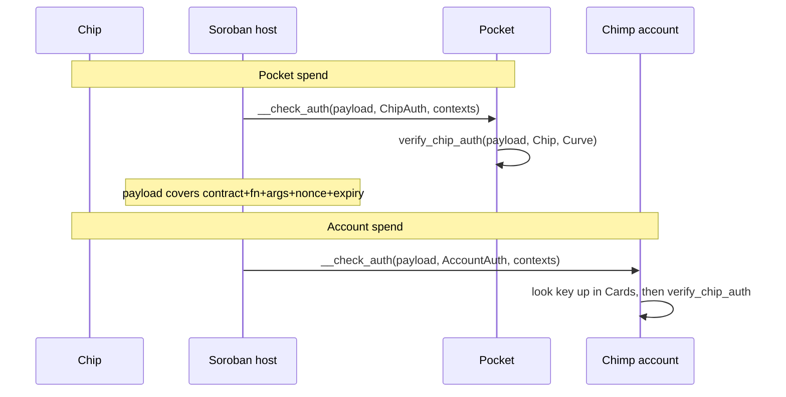

# ChipAuth

How chip signatures authorize state changes. Shared crypto lives in
[`contracts/chip-auth/`](../contracts/chip-auth/).

There are **two** models, and the difference is what the chip is being asked to prove.

| | Chip is… | Mechanism | Contracts |
|---|---|---|---|
| **Account auth** | the account's key | `CustomAccountInterface` — the host builds the payload | `pocket`, `account` |
| **Presence attestation** | a second factor beside a wallet | `call_digest` over the specific call | `nfc-nft`, `examples/prize` |

Both bind the call. Neither accepts an opaque blob any more.

## Account auth — Pocket and the Chimp account

Both implement `__check_auth`, and **both sign exactly the same thing**: the payload the
**host** computes.

```text
sha256(HashIdPreimage::SorobanAuthorization {
  network_id, nonce, signature_expiration_ledger, invocation
})
```

`invocation` is the contract, function name, argument `ScVal`s and sub-invocations
actually being executed. Change the destination or the amount and the digest changes, so
the signature stops verifying. Replay and expiry are enforced by the host, which is why
Pocket keeps no nonce of its own.

Consequences worth knowing:

- **There is no Pocket `transfer` entry point.** A payment is a plain SAC
  `transfer(pocket, merchant, amount)`; the host routes authorization to Pocket. The
  same purse therefore works with Blend or any other contract without new code.
- Chip-gated configuration (`upgrade`) calls `require_auth` on the contract's own
  address, which routes to `__check_auth` and binds that call's arguments. `set_owner`
  and `sweep` are owner-gated instead — they are the handover and lost-card paths, and
  must work when the card is gone.
- Pocket verifies **inline**. It stores the card's `Curve` and calls
  `chimpdao_chip_auth::verify_chip_auth` directly, rather than cross-calling a registry.
  There is no stored verifier address for a departing holder to re-point, no purse that
  a bricked registry can freeze, and no re-entrancy surface inside `__check_auth`.

### What this replaced, and why

Pocket used to verify `sha256(message ‖ signer ‖ nonce)` where `message` was an opaque
caller-supplied blob. Clients put a SEP-53 envelope describing the call into it, but the
contract never parsed it — so nothing on-chain tied a signature to `token`, `to` or
`amount`, and `transfer` had no `require_auth` at all.

One `(message, auth, nonce)` tuple therefore authorized *any* transfer of *any* amount to
*any* destination. The tuple did not need a compromised terminal to leak: a transaction
envelope is flooded across the overlay before ledger close, and any transfer that failed
during execution left the tuple readable on-ledger with its nonce unconsumed. Either gave
a third party a full-authority credential.

`pocket/src/test.rs::check_auth_rejects_a_bad_signature` covers the rejection
path; the binding itself is host behavior, proven in the live hardware runs.

### The Chimp account — same payload, different envelope

A purse is bound to one card, so its signature needs to carry nothing but the signature.
An account holds several, so the envelope must also say **which** card signed:

```rust
pub struct CardSigner { pub key: BytesN<65>, pub curve: Curve }   // stored, per card
pub struct AccountAuth { pub key: BytesN<65>, pub auth: ChipAuth } // presented per call
```

`__check_auth` looks `key` up in `Cards` and verifies `auth` against **that stored
entry's** curve and key. Naming someone else's card therefore buys nothing: the
signature still has to verify against the entry it selected.

`auth_contexts` is deliberately ignored. Any card on the account may authorize any
context — that is what 1-of-n means — and not matching on `Context` also keeps the
contract forward-compatible with CAP-85, which adds a variant.

**There is no digest transformation.** Earlier the account hashed
`sha256(signature_payload ‖ context_rule_ids)`; that is gone with the rules, and with it
the `ContextRuleIdsLengthMismatch` class of failure where a signature was valid but
counted against the wrong number of contexts.

Signer management (`add_card`, `remove_card`, `abandon`, `upgrade`) is authorized by the
account itself, which routes straight back through `__check_auth` — so "an existing card
consents" is the same statement as "the account authorized it". `remove_card` refuses the
last card (`LastCard`, #303): an account with no signer can never authorize anything
again, including adding a signer back. Emptying an account deliberately is `abandon()`,
which is what a sole-card handover uses.

The exact bytes the terminal builds for both envelopes are pinned by
`contracts/account/src/test.rs` (`terminal_constructor_args_decode_as_cards`,
`terminal_card_signer_decodes_on_both_curves`, `terminal_account_auth_decodes_on_both_curves`),
which decode real client XDR. Nothing else would catch a field-order or variant-name
drift across the two repos — it would surface only as an opaque auth failure on hardware.

## Presence attestation — nfc-nft

Here the chip is not the account. A wallet authorizes the action through its own Soroban
auth, and the chip separately proves the physical object was on the reader — which is
what "physical-backed" means. `nfc-nft` verifies that itself:

```text
digest = sha256(domain ‖ contract_xdr ‖ fn_name_xdr ‖ args_xdr ‖ nonce_xdr)
```

Built by [`call_digest`](../contracts/chip-auth/src/verify.rs). Every field the chip
attests to is inside the hash, so an attestation is good for exactly one call to one
function of one contract with one set of arguments, once.

`domain` is per contract family (`chimpdao.nfc-nft.v2`, `chimpdao.prize.v1`), so an
attestation cannot be carried between them.

`verify_for_card(public_key, digest, auth)` is public, but it is a *stateless* oracle
over the registry's stored key and curve: it returns a bool and never produces a
signature, so it leaks nothing an offline check could not. Replay is the caller's
problem — integrators bring their own domain and nonce and verify under those, see
[`examples/prize`](../examples/prize/).

## Curves

| Curve | Path |
|-------|------|
| secp256k1 (Infineon) | `secp256k1_recover(digest, sig, recovery_id)` == stored SEC1 pubkey |
| secp256r1 IntAuth (DUOX) | `F0 F0 ‖ 80 00 ‖ RndB(16) ‖ digest[0..16]` → sha256 → `secp256r1_verify` |

Two asymmetries to respect when composing:

- **k1 returns false; r1 traps.** `secp256r1_verify` is a host function with no fallible
  form. Both fail closed, but in a multi-signer rule a `false` lets another signer
  satisfy it while a trap aborts the transaction.
- **DUOX truncates the digest to 128 bits.** IntAuth carries a 16-byte challenge, so an
  r1 signature commits to `digest[0..16]`. Second-preimage resistance is still 128 bits,
  but ~2^64 under a chosen-message attack. This is why the NFC bridge must not be an open
  signing oracle, and why k1 is preferable for high-value rules.

## Verification is linked, not delegated

There are no verifier contracts. `chimpdao-chip-auth` is an rlib and both algorithms are
implemented in it exactly once; `account` and `pocket` link it and call
`verify_chip_auth` directly.

That is a security property, not just a simplification. Delegating verification to a
*stored contract address* is what made the earlier `set_nfc` hijack possible: whoever
controlled the pointer could approve anything. Linking removes that class outright, along
with the liveness coupling (a bricked registry froze every purse) and the ordering
constraint that a card be minted before its purse could authorize.

The cost, stated plainly: a crypto fix becomes a fleet upgrade rather than one contract.
That is what `UpgradePolicy` exists for, and the crypto is ~1–2 KB of wasm.

`nfc-nft.verify_for_card` remains for *integrators* — see [`examples/prize`](../examples/prize/)
— so an outside contract can check a card signature without linking our rlib.

### Passkey recovery is deferred

Earlier revisions enrolled a WebAuthn passkey as a second signer, so an account could be
recovered with every card lost. **That is removed, not merely unimplemented**: today an
account whose cards are all lost cannot be recovered. No live user is affected (mainnet
has no smart accounts and testnet is fresh), and the seam is kept on purpose — `Cards` is
its own storage key so a `Passkeys` set needs no migration, and `AccountAuth` can gain a
variant. Re-adding it means writing WebAuthn assertion verification into `chip-auth`.

A card leaving an account (`give`) is handled by nfc-nft's `transfer` in one tree: it
joins `to`, re-points the purse with `set_owner`, then leaves `from`. The purse's DeFi
positions travel with it, so a loaded card can be gifted with no unwind.

## Soulbound NFT

A card's token can only live on an account the card can sign for. Both entry points
cross-call `account.has_card(public_key)` — exact, because identity *is* the key, so
there is no second rule a departed card could still be listed in — but they enforce it
differently:

- **`claim` requires existing membership.** The destination must already list the card;
  otherwise `NotCardHolder` (#214). The gate runs before signature work.
- **`transfer` establishes it.** If the destination does not list the card, transfer
  calls `add_card` (which needs `to`'s own authorization) rather than rejecting. It then
  leaves `from` — `abandon()` when the card was the last one, else `remove_card`.

Either way a G address or a foreign contract without `has_card` fails the call. Note that
a contract which merely *implements* `has_card` can satisfy the `claim` gate; possession
of the card is what actually bounds this, not the lookup.

## Auth matrix

| Entry | Wallet `require_auth` | Chip | Notes |
|-------|----------------------|------|-------|
| nfc `mint` | admin | attestation over `[pubkey, curve]` | records curve + pubkey↔token |
| nfc `claim` | claimant | attestation over `[claimant]` | destination must already list the card |
| nfc `transfer` | from | attestation over `[from, to, token_id]` | pubkey must match the token; joins `to` if needed, then asserts the card left `from` |
| nfc `clawback` | admin | — | central escape hatch |
| nfc `set_trait` / `set_trait_metadata_uri` | admin | — | ERC-7496; `tier` is the only trait |
| nfc `pocket` / `trait_value` / `verify_for_card` | — | — | public views |
| Pocket everything | — | `__check_auth` | chip is the account |
| Pocket `sweep` / `set_owner` | owner (Chimp account) | — | recovery / card handover; must work without the chip |
| account `add_card` / `remove_card` / `abandon` / `upgrade` | the account itself → `__check_auth` | any card on it | 1-of-n; `remove_card` refuses the last |
| account `cards` / `has_card` | — | — | public views |
| factory / collection admin | admin | — | central deployer / index |

## Digest / replay matrix

One client path builds every smart-account signature
(`signAuthEntry → refitAuth` in chimpdao-terminal `src/chain/chip-auth.ts`, with the
envelope supplied by `chipAuthForDigest` or `accountChipSignature`); nothing else
constructs payloads.

| Path | What is signed | Envelope | Replay stops at |
|------|----------------|----------|-----------------|
| Pocket (`__check_auth`) | host `SorobanAuthorization` preimage | `ChipAuth` | host nonce + expiration ledger |
| Account (`__check_auth`) | **the same preimage** | `AccountAuth { key, auth }` | host nonce + expiration ledger |
| nfc-nft attestation | `call_digest(domain, contract, fn, args, nonce)` | `ChipAuth` | per-chip monotonic nonce |
| prize attestation | same, domain `chimpdao.prize.v1` | `ChipAuth` | its own per-chip nonce |

There is now exactly **one** smart-account digest. A signature is not portable between a
purse and an account anyway: the preimage carries the invocation, which names the
contract being authorized. Attestations are separated from both by their domain.

## Pocket vs account



The two differ only in how the signer is found: a purse has one card in storage, an
account has a set and the envelope names which one. Both then run the same linked
verification over the same host payload, and both let the host own binding, replay and
expiry. Do not add an app nonce to either.

## Trust model

| Layer | Who can hurt you |
|-------|------------------|
| Central (collection, factory, nfc mint/clawback) | protocol admin |
| Pocket | whoever holds the physical chip — bounded by the purse float *and its positions* |
| Pocket recovery | the owning Chimp account (`sweep`) |
| Chimp account | **any one** of its cards (1-of-n) — a lost card is a live signer until removed |
| Account recovery | none today — passkeys are deferred; the last card cannot be removed, only `abandon`ed |
| NFT claim/transfer | needs **both** wallet auth and the physical card |
