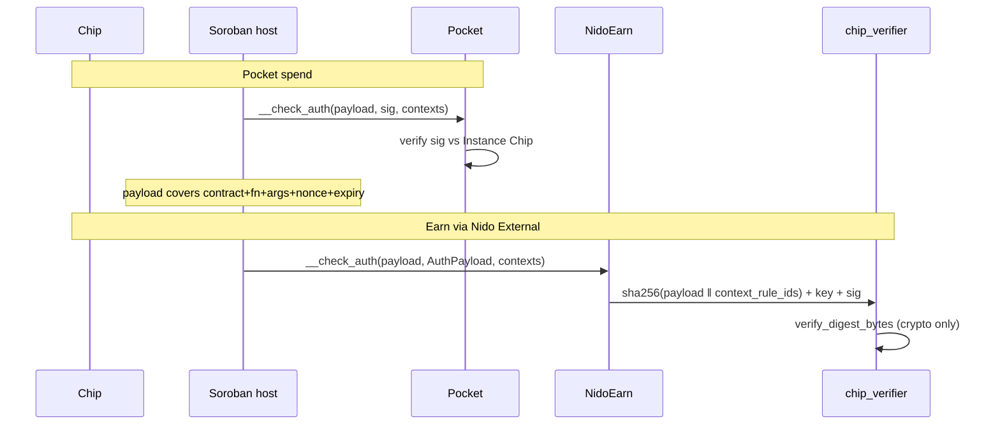

# ChipAuth

How chip signatures authorize state changes. Shared crypto lives in
[`contracts/chip-auth/`](../contracts/chip-auth/).

There are **two** models, and the difference is what the chip is being asked to prove.

| | Chip is… | Mechanism | Contracts |
|---|---|---|---|
| **Account auth** | the account's key | `CustomAccountInterface` — the host builds the payload | `smart-account` (Pocket) |
| **Presence attestation** | a second factor beside a wallet | `call_digest` over the specific call | `nfc-nft`, `examples/prize` |

Both bind the call. Neither accepts an opaque blob any more.

## Account auth — Pocket

Pocket implements `__check_auth`. The chip signs the payload the **host** computes:

```text
sha256(HashIdPreimage::SorobanAuthorization {
  network_id, nonce, signature_expiration_ledger, invocation
})
```

`invocation` is the contract, function name, argument `ScVal`s and sub-invocations
actually being executed. Change the destination or the amount and the digest changes, so
the signature stops verifying. Replay and expiry are enforced by the host, which is why
Pocket keeps no nonce of its own.

Consequences worth knowing:

- **There is no Pocket `transfer` entry point.** A payment is a plain SAC
  `transfer(pocket, merchant, amount)`; the host routes authorization to Pocket. The
  same purse therefore works with Blend or any other contract without new code.
- Chip-gated configuration (`upgrade`, `set_earn`, `upsert_position`, …) calls
  `require_auth` on the contract's own address, which routes to `__check_auth` and binds
  that call's arguments.

### What this replaced, and why

Pocket used to verify `sha256(message ‖ signer ‖ nonce)` where `message` was an opaque
caller-supplied blob. Clients put a SEP-53 envelope describing the call into it, but the
contract never parsed it — so nothing on-chain tied a signature to `token`, `to` or
`amount`, and `transfer` had no `require_auth` at all.

One `(message, auth, nonce)` tuple therefore authorized *any* transfer of *any* amount to
*any* destination. The tuple did not need a compromised terminal to leak: a transaction
envelope is flooded across the overlay before ledger close, and any transfer that failed
during execution left the tuple readable on-ledger with its nonce unconsumed. Either gave
a third party a full-authority credential.

`smart-account/src/test.rs::signature_for_one_call_does_not_authorize_another` is the
regression test.

## Presence attestation — nfc-nft

Here the chip is not the account. A wallet authorizes the action through its own Soroban
auth, and the chip separately proves the physical object was on the reader — which is
what "physical-backed" means. `nfc-nft` verifies that itself:

```text
digest = sha256(domain ‖ contract_xdr ‖ fn_name_xdr ‖ args_xdr ‖ nonce_xdr)
```

Built by [`call_digest`](../contracts/chip-auth/src/verify.rs). Every field the chip
attests to is inside the hash, so an attestation is good for exactly one call to one
function of one contract with one set of arguments, once.

`domain` is per contract family (`chimpdao.nfc-nft.v2`, `chimpdao.prize.v1`), so an
attestation cannot be carried between them.

There is no public verify entry point: integrators verify in their own contract under
their own domain — see [`examples/prize`](../examples/prize/).

## Curves

| Curve | Path |
|-------|------|
| secp256k1 (Infineon) | `secp256k1_recover(digest, sig, recovery_id)` == stored SEC1 pubkey |
| secp256r1 IntAuth (DUOX) | `F0 F0 ‖ 80 00 ‖ RndB(16) ‖ digest[0..16]` → sha256 → `secp256r1_verify` |

Two asymmetries to respect when composing:

- **k1 returns false; r1 traps.** `secp256r1_verify` is a host function with no fallible
  form. Both fail closed, but in a multi-signer rule a `false` lets another signer
  satisfy it while a trap aborts the transaction.
- **DUOX truncates the digest to 128 bits.** IntAuth carries a 16-byte challenge, so an
  r1 signature commits to `digest[0..16]`. Second-preimage resistance is still 128 bits,
  but ~2^64 under a chosen-message attack. This is why the NFC bridge must not be an open
  signing oracle, and why k1 is preferable for high-value rules.

## Auth matrix

| Entry | Wallet `require_auth` | Chip | Notes |
|-------|----------------------|------|-------|
| nfc `mint` | admin | attestation over `[pubkey, curve]` | records curve + pubkey↔token |
| nfc `claim` | claimant | attestation over `[claimant]` | |
| nfc `transfer` | from | attestation over `[from, to, token_id]` | pubkey must match the token |
| nfc `clawback` | admin | — | central escape hatch |
| Pocket everything | — | `__check_auth` | chip is the account |
| Pocket `sweep` | owner (Nido) | — | lost-card recovery; must work without the chip |
| factory / collection admin | admin | — | central deployer / index |
| chip-verifier `verify` | OZ account auth tree | crypto only | Earn; stateless |

## Pocket vs Earn



- **Pocket:** the chip is the account key. Host-enforced binding, replay and expiry.
- **Earn:** `chip-verifier` is a stateless OZ `Verifier`. OZ hashes the host payload
  together with the context rule ids, so the signature binds the rule as well as the
  invocation. Do not add an app nonce to the verifier.

## Trust model

| Layer | Who can hurt you |
|-------|------------------|
| Central (collection, factory, nfc mint/clawback) | protocol admin |
| Pocket | whoever holds the physical chip — bounded by the purse float |
| Pocket recovery | the owning Nido account (`sweep`) |
| Earn | chip + Nido/OZ account rules + verifier crypto |
| NFT claim/transfer | needs **both** wallet auth and the physical card |
